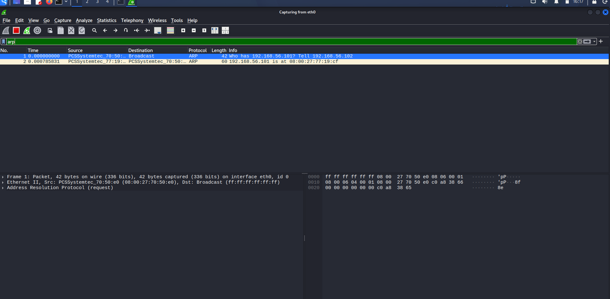
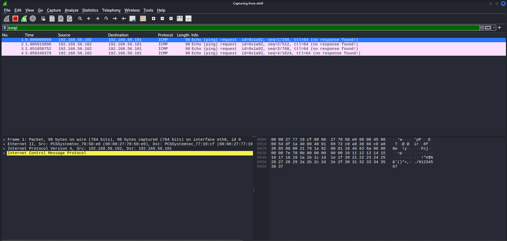
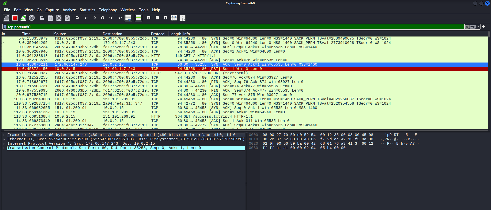
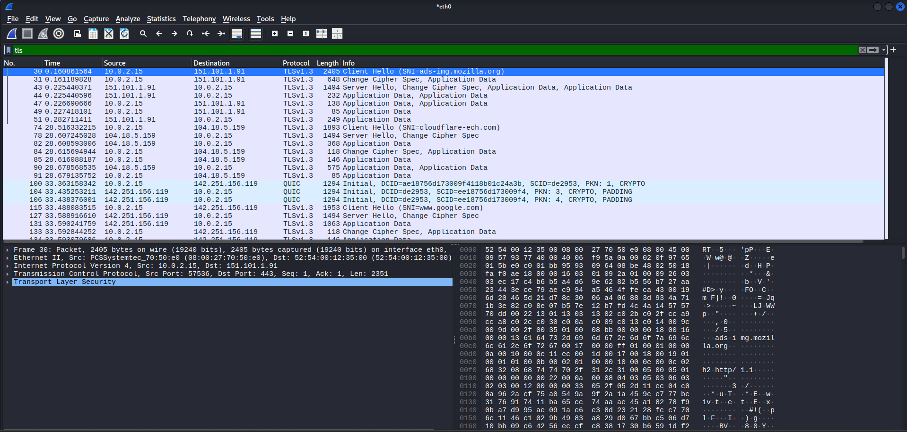

# 🦈 Wireshark Network Analysis


---

## 📖 Overview

This repository documents hands-on packet analysis performed using **Wireshark** in a virtual lab environment.

The objective of this project is to understand how common network protocols operate and how security analysts inspect network traffic during troubleshooting, incident response, malware investigations, and threat hunting.

---
## 📑 Table of Contents

- [Lab Environment](#-lab-environment)
- [Project Structure](#-project-structure)
- [ARP Protocol Analysis](#1️⃣-address-resolution-protocol-arp)
- [ICMP Protocol Analysis](#2️⃣-internet-control-message-protocol-icmp)
- [DNS Protocol Analysis](#3️⃣-domain-name-system-dns)
- [TCP Three-Way Handshake](#4️⃣-tcp-three-way-handshake)
- [Skills Demonstrated](#-skills-demonstrated)
- [Key Learnings](#-key-learnings)
- [Future Work](#-future-work)
- [License](#-license)

## 🎯 Objectives

- Understand packet structures
- Capture real network traffic
- Analyze common network protocols
- Develop packet inspection skills
- Build a practical cybersecurity portfolio

---

# 🖥️ Lab Environment

| Component | Details |
|-----------|---------|
| Operating System | Kali Linux |
| Virtualization | Oracle VirtualBox |
| Network | NAT + Host-Only |
| Tool | Wireshark |

---

# 📂 Project Structure

```text
wireshark-network-analysis/
│
├── README.md
├── LICENSE
│
├── captures/
│   ├── arp.pcapng
│   ├── icmp.pcapng
│   └── dns.pcapng
│
└── images/
    ├── 01-arp-analysis.png
    ├── 02-icmp-analysis.png
    └── 03-dns-analysis.png
```

---

# 📡 Protocol Analysis

---

# 1️⃣ Address Resolution Protocol (ARP)

## Display Filter

```text
arp
```

## Capture

<p align="center">

</p>

### What Happened?

The client broadcasts an ARP Request asking:

> "Who has this IP address?"

The destination device replies with its MAC address.

### Security Relevance

- Detect ARP Spoofing
- Identify Duplicate IPs
- Investigate Layer-2 attacks

---

# 2️⃣ Internet Control Message Protocol (ICMP)

## Display Filter

```text
icmp
```

## Capture

<p align="center">

</p>

### What Happened?

An ICMP Echo Request (Ping) is sent to verify host availability.

The destination responds with an ICMP Echo Reply.

### Security Relevance

- Connectivity Testing
- Network Troubleshooting
- Detect Ping Sweeps
- Detect Reconnaissance

---

# 3️⃣ Domain Name System (DNS)

## Display Filter

```text
dns
```

## Command

```bash
dig google.com
```

## Capture

<p align="center">

</p>

### Packet Summary

| Field | Value |
|-------|-------|
| Source IP | 10.0.2.15 |
| Destination IP | 172.23.203.65 |
| Protocol | DNS |
| Port | UDP 53 |
| Query | google.com |
| Response | 142.251.223.238 |

### What Happened?

The client sends a DNS query requesting the IPv4 address of **google.com**.

The DNS server responds with the corresponding IP address.

### Security Relevance

DNS traffic is frequently analyzed to detect:

- DNS Tunneling
- Malware Communication
- Command-and-Control (C2)
- Suspicious Domains
- Threat Hunting Indicators

---
---

# 4️⃣ TCP Three-Way Handshake

## Objective

Capture and analyze the TCP Three-Way Handshake used to establish a reliable connection before HTTP communication.

---

## Display Filter

```text
tcp.port==80
```

---

## Command Used

```bash
curl http://example.com
```

---

## TCP Capture



*Figure 4: TCP Three-Way Handshake and HTTP communication captured using Wireshark.*

---

## Packet Flow

| Step | Packet | Description |
|------|--------|-------------|
| 1 | SYN | Client initiates a TCP connection to the web server. |
| 2 | SYN-ACK | Server acknowledges the connection request. |
| 3 | ACK | Client confirms the connection. |
| 4 | HTTP GET | Client requests the web page. |
| 5 | HTTP/1.1 200 OK | Server returns the requested content. |

---

## Packet Summary

| Field | Value |
|-------|-------|
| Client IP | 10.0.2.15 |
| Server IP | 172.66.147.243 |
| Destination Port | 80 |
| Protocol | TCP |
| Application Protocol | HTTP |

---

## Security Relevance

The TCP Three-Way Handshake establishes a reliable connection before data transmission.

Security analysts examine TCP handshakes to detect:

- SYN Flood attacks
- Port scanning
- Connection failures
- Service availability issues
- Network reconnaissance

---

## Key Takeaways

- TCP is a **connection-oriented** protocol.
- Three packets are exchanged before data transfer begins.
- HTTP communication starts only after the TCP connection has been established.
- Wireshark provides visibility into every stage of the TCP connection.

- ---

# 5️⃣ TLS (HTTPS) Handshake Analysis

## 🎯 Objective

Capture and analyze the TLS 1.3 handshake used to establish an encrypted HTTPS connection between a client and a web server.

---

## 🖥️ Lab Environment

| Component | Details |
|-----------|---------|
| Operating System | Kali Linux |
| Virtualization | Oracle VirtualBox |
| Tool | Wireshark |
| Network Mode | NAT |

---

## 🔍 Display Filter

```text
tls
```

> If your Wireshark version does not recognize `tls`, use:

```text
tcp.port == 443
```

---

## 🌐 Activity Performed

Accessed the following HTTPS websites using Firefox:

```text
https://example.com
https://google.com
```

---

## 📸 TLS Capture

<p align="center">

</p>

<p align="center">
<b>Figure 5:</b> TLS 1.3 handshake captured using Wireshark.
</p>

---

## 📂 Packet Capture

```
captures/05-tls-handshake.pcapng
```

---

## 📊 Packet Analysis

| Field | Value |
|-------|-------|
| Client IP | 10.0.2.15 |
| Protocol | TLS 1.3 |
| Destination Port | 443 |
| Transport Protocol | TCP |
| Application Protocol | HTTPS |

---

## 🔄 TLS Handshake Process

| Step | Description |
|------|-------------|
| Client Hello | Client initiates a secure connection and advertises supported TLS versions and cipher suites. |
| Server Hello | Server selects the TLS version and cipher suite. |
| Certificate | Server presents its digital certificate for authentication. |
| Key Exchange | Client and server establish a shared encryption key. |
| Encrypted Application Data | Secure communication begins after the handshake completes. |

---

## 🛡️ Security Relevance

TLS provides three primary security services:

- 🔒 Encryption
- ✅ Authentication
- ✔️ Data Integrity

SOC analysts inspect TLS traffic to:

- Verify server certificates
- Detect outdated TLS versions
- Identify weak cipher suites
- Investigate suspicious encrypted communications
- Detect potential malware Command-and-Control (C2) traffic

---

## 📚 Key Takeaways

- HTTPS uses TLS to encrypt web traffic.
- TLS 1.3 provides improved security and faster handshakes.
- Application data remains encrypted after the handshake.
- Wireshark can analyze the handshake but cannot decrypt encrypted payloads without the appropriate session keys.

---

## 💡 Skills Demonstrated

- TLS 1.3 Packet Analysis
- HTTPS Traffic Analysis
- Wireshark Protocol Inspection
- Secure Communication Analysis
- Network Traffic Monitoring
# 🛠 Skills Demonstrated

- Wireshark Packet Analysis
- ARP Analysis
- ICMP Analysis
- DNS Analysis
- TCP Three-Way Handshake Analysis
- HTTP Traffic Analysis
- Network Troubleshooting
- Packet Inspection
- Security Monitoring
---

# 📚 Key Learnings

✅ Layer 2 Communication

✅ Layer 3 Communication

✅ Name Resolution

✅ Packet Inspection

✅ Network Troubleshooting

✅ Security Monitoring

---

# 🚀 Future Work

- TCP Three-Way Handshake
- HTTP Analysis
- HTTPS / TLS Handshake
- DHCP Analysis
- FTP Analysis
- SMB Analysis
- SSH Analysis

---

# 📜 License

This project is licensed under the MIT License.

---

## 👨‍💻 Author

**Jaison Jerald**

- GitHub: https://github.com/jaisonjerald
- CEH (Certified Ethical Hacker)
- IT Support & Cybersecurity Enthusiast
