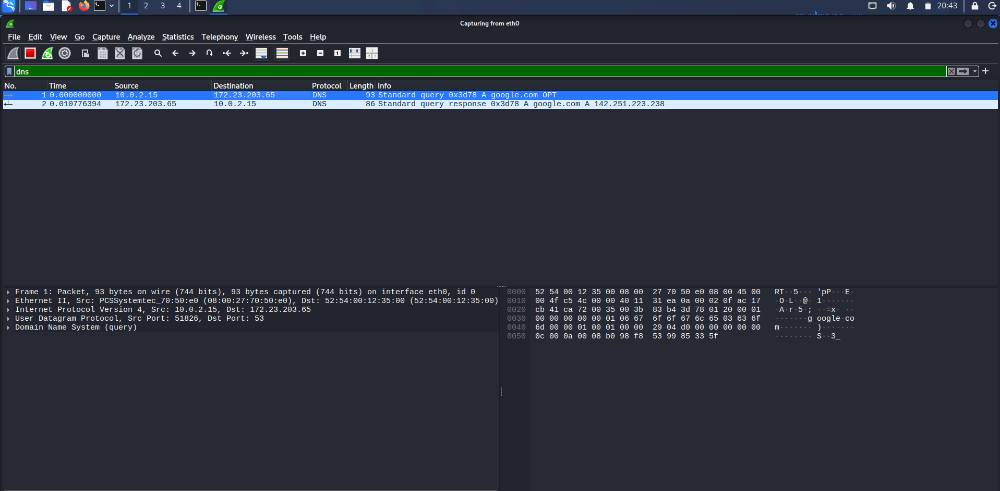

# DNS Protocol Analysis

## Objective

Capture and analyze DNS request and response packets using Wireshark.

## Lab Environment

- Kali Linux
- VirtualBox
- Wireshark
- NAT Network

## Display Filter

```text
dns
```

## Command Used

```bash
dig google.com
```

## DNS Capture



*Figure 1: DNS query and response captured using Wireshark.*

---

## Packet Analysis

### DNS Query

| Field | Value |
|--------|-------|
| Source IP | 10.0.2.15 |
| Destination IP | 172.23.203.65 |
| Protocol | DNS |
| Transport | UDP |
| Destination Port | 53 |
| Query Type | A Record |
| Domain | google.com |

### DNS Response

| Field | Value |
|--------|-------|
| Source IP | 172.23.203.65 |
| Destination IP | 10.0.2.15 |
| Response | google.com → 142.251.223.238 |

---

## Security Analysis

DNS translates domain names into IP addresses.

Security analysts inspect DNS traffic to:

- Detect malicious domains
- Identify DNS tunneling
- Investigate malware communication
- Detect command-and-control (C2) traffic
- Analyze DNS-based attacks

---

## Key Learning

- DNS uses UDP port 53 by default.
- A records resolve hostnames to IPv4 addresses.
- Every web request typically begins with a DNS lookup.
- Wireshark can capture both DNS requests and responses for troubleshooting and security analysis.

---

## Skills Demonstrated

- Wireshark Packet Analysis
- DNS Protocol Analysis
- Network Troubleshooting
- Packet Inspection
- Security Monitoring
